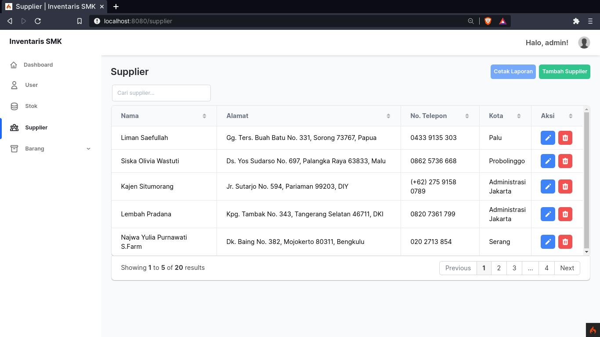

# Aplikasi Inventaris PHP

> disclaimer:
> Ini aplikasi bikinnya ngga pake niat sepenuhnya
> soalnya aku ga suka PHP hehe

## Teknologi yang digunakan

- [PHP](https://www.php.net/) - Bahasa yang digunakan
- [CodeIgniter](https://codeigniter.com) - Framework PHP
- [Faker](https://fakerphp.github.io/) - Untuk membuat data palsu
- [TailwindCSS](https://tailwindcss.com) - Library CSS
- [Windmill Template](https://windmillui.com) - Template dashboard
- [Neovim](https://neovim.io/) - Text Editor
- [MariaDB/MySQL](https://mariadb.org/) - Database SQL
- [HeroIcons](https://heroicons.com/) - Kumpulan ikon yang digunakan
- [Docker](https://www.docker.com/) - Kontainerisasi agar aplikasi lebih mudah di-deploy dimana saja

## Database

Jadi gini.. Database di soal-nya berantakan banget. Tipe data yg dipake ada
yang ngawur. Relasinya ga bakal bisa nyambung -- karena ya itu tadi, tipe
datanya ada yang ngawur.

Akhirnya dibedain, karena kalo sama kaya ga bakal bisa dipake.

|       Setelah Desain Ulang       |              Yang Asli              |
| -------------------------------- | ----------------------------------- |
|  |  |

## Screenshots

### Login

### Dashboard

### Manajemen User

### Manajemen Stok

### Manajemen Supplier

### Manajemen Barang

### Manajemen Barang Masuk

### Manajemen Barang Keluar

### Form + Validation

### Export .xlsx

