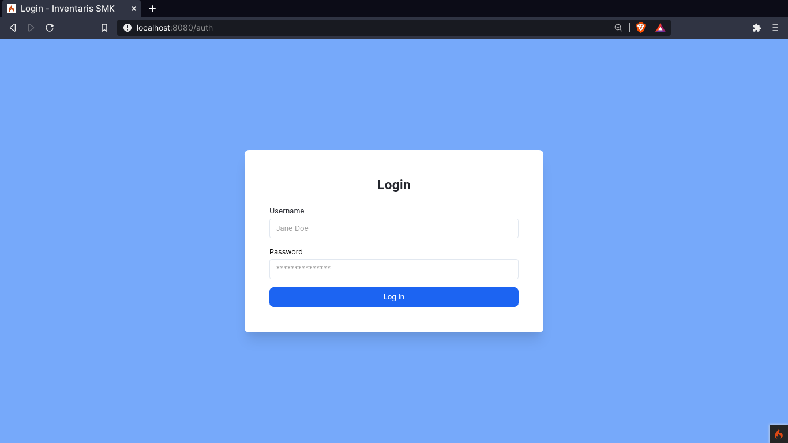
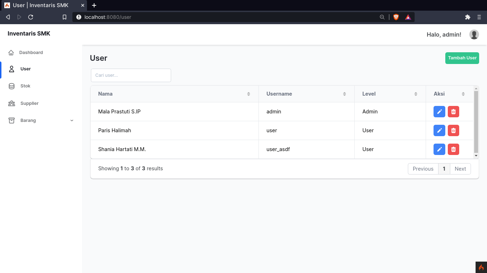
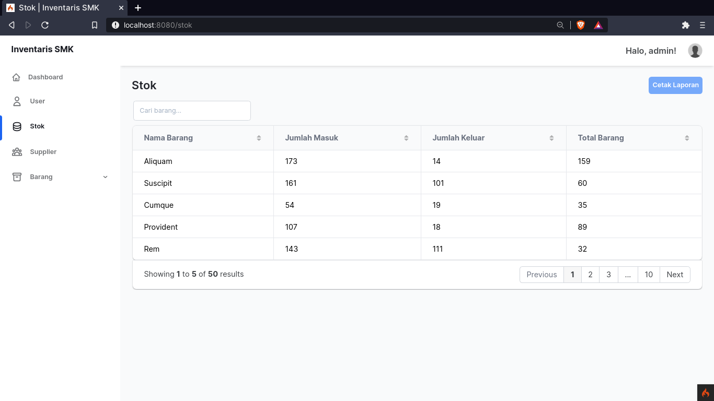
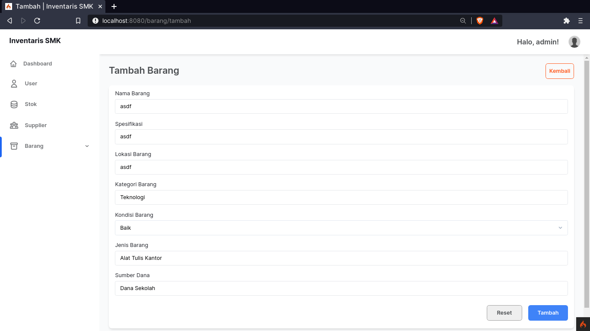

# Aplikasi Inventaris PHP

> disclaimer: This is my first time creating a *proper* app using CodeIgniter 
> so please don't expect anything :p

> WIPPP

## What I use to make this app

- [PHP](https://www.php.net/) - The language itself
- [CodeIgniter](https://codeigniter.com) - PHP framework, v4 is surprisingly good
- [Faker](https://fakerphp.github.io/) - To generate dummy data
- [TailwindCSS](https://tailwindcss.com) - The CSS library
- [Windmill Template](https://windmillui.com) - The dashboard template
- [Neovim](https://neovim.io/) - The text editor
- [MariaDB/MySQL](https://mariadb.org/) - The database
- [HeroIcons](https://heroicons.com/) - The beautiful icons used

## Database

The original design is a mess and wouldn't even work because the relationship
does not have the same data type lol. So, here's how the database laid out. 
(My own version compared to the original design)

|           My version             |               Original              |
| -------------------------------- | ----------------------------------- |
|  |  |

## Screenshots

Some images yada yada yada

### Login

### Dashboard

### Manajemen User

### Manajemen Stok

### Manajemen Supplier

### Manajemen Barang

### Manajemen Barang Masuk

## Manajemen Barang Keluar

## Form + Validation

## Manual

### Project Structure

Here's a project structure that will (hopefully) guide you to understand this app.

TBD

### How it works (briefly).

TBD
